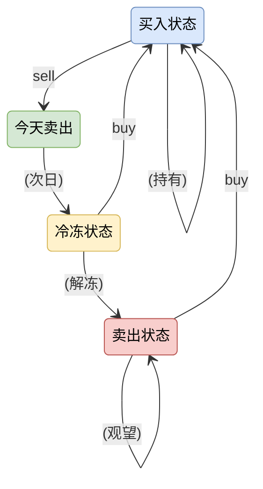

```python
class Solution:
    def maxProfit(self, prices: List[int]) -> int:
        buy = - prices[0] # 0
        sell = 0 # 2
        freeze = 0 # 3
        sold = 0 # 1
        for i in range(1, len(prices)):
            tbuy = max(buy, 
                    freeze - prices[i],
                    sold - prices[i]) # 买了一直持有，冻结完了立马买，冻结完了不立马买
            tsell = buy + prices[i] # 只有一种情况，如果这一天要卖上一天一定要持有，是否最大在持有里考虑的
            tfreeze = sell # 只有一种情况，昨天刚卖
            tsold = max(sold, freeze) # 前一天是sold，前一天是freeze
            buy, sell, freeze, sold = tbuy, tsell, tfreeze, tsold
        return max(buy, sell, freeze, sold)
```

